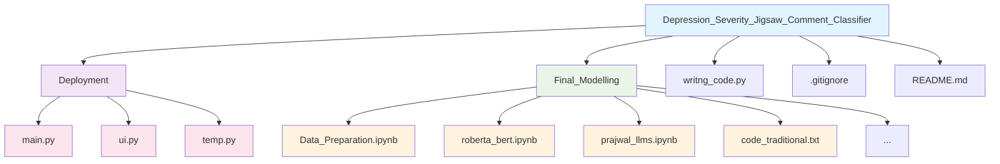
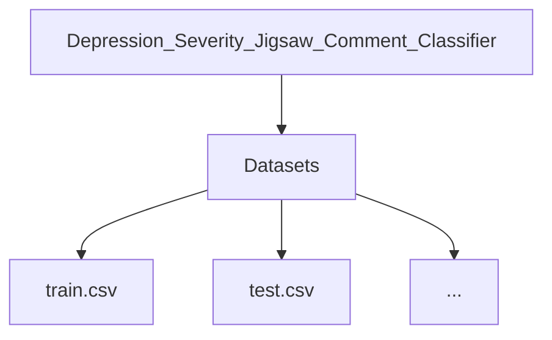
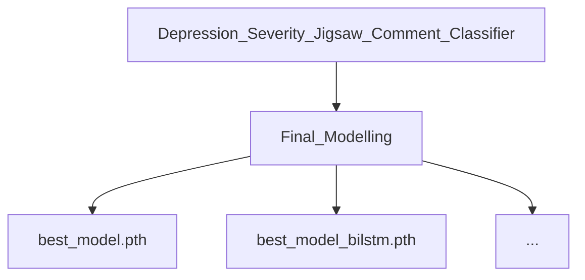

# 🧠 Depression Severity - Jigsaw Comment Classifier Challenge
An **NLP + Deep Learning project** to classify toxic and harmful comments across multiple categories using **BiGRU, DistilBERT, and RoBERTa**.  
Deployed as a **Streamlit web app with FastAPI backend** for real-time predictions.

---

### 📌 Features
- 🔹 Multi-label classification of toxic comments (6 categories).  
- 🔹 Tackled **highly imbalanced dataset** with focal loss, weighted sampling & threshold tuning.  
- 🔹 Benchmarked multiple models:
  - **BiGRU baseline:** 70% precision / 70% recall  
  - **DistilBERT:** 80% / 80%  
  - **RoBERTa:** 75% precision / 85% recall  
- 🔹 Deployment-ready with **FastAPI + Streamlit**.  

---

### 📂 Project Structure


### 📊 Models Tested
| Model        | Precision | Recall | Notes |
|--------------|-----------|--------|-------|
| BiGRU        | 70%       | 70%    | Baseline |
| DistilBERT   | 80%       | 80%    | Balanced performance |
| RoBERTa      | 75%       | 85%    | Higher recall (rare classes) |

---

### 📂 Data & Models
⚠️ **Important:** Large datasets and model checkpoints are **not included** in this repo (ignored via `.gitignore`).  

### 🔹 Datasets
- Project uses **[Jigsaw Toxic Comment Classification Dataset](https://www.kaggle.com/c/jigsaw-toxic-comment-classification-challenge/data)** (Kaggle).  
- Download and place inside:

---
### 🔹 Trained Models
- Fine-tuned models (e.g., `.pth`, `.safetensors`) are too large for GitHub.  
- Download from:
- Hugging Face: *[your-link-here]*  
- OR Google Drive: *[your-link-here]*  

Place inside:


---
### ▶️ Running the Project

1️⃣ Install requirements
```bash
pip install -r requirements.txt
```

2️⃣ Start FastAPI backend
```bash
uvicorn Deployment.main:app --reload
```

3️⃣ Start Streamlit UI
```bash
streamlit run Deployment/ui.py
Now open the local Streamlit link in your browser and test the toxicity classifier 🎉
```

---
🚀 Future Improvements
Optimize RoBERTa with mixed precision training (faster training).

Deploy with Docker + AWS/GCP.

Add explainability layer (SHAP/LIME) to interpret predictions.

👨‍💻 Author
Ketan Gupta
📧 Email 12212041ketanguptait@gmail.com
💼 LinkedIn https://www.linkedin.com/in/ketangupta41

⭐ Contribute
Pull requests are welcome! For major changes, please open an issue first to discuss.
If you find this repo useful, don’t forget to ⭐ star it!
---

✨ This README covers:  
- Overview with emojis for appeal.  
- Features & models.  
- Project structure.  
- Clear section on ignored files (**Datasets & Models**).  
- How to run.  
- Future scope + contribution.  

